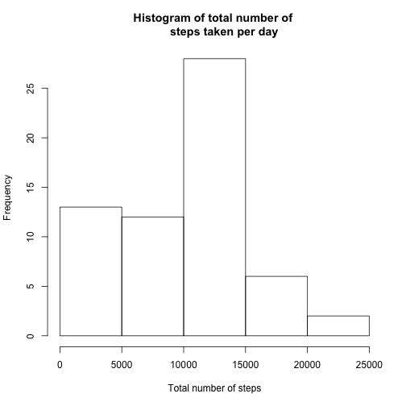
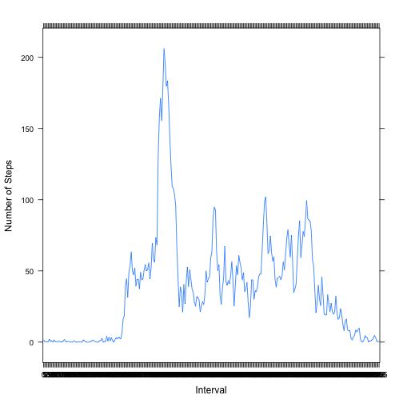
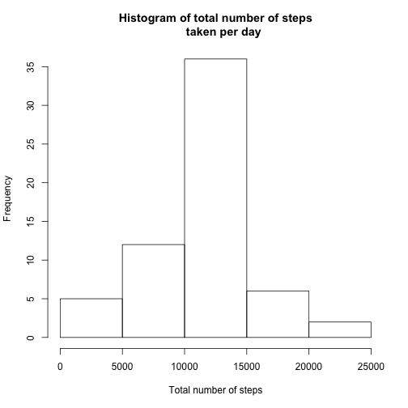
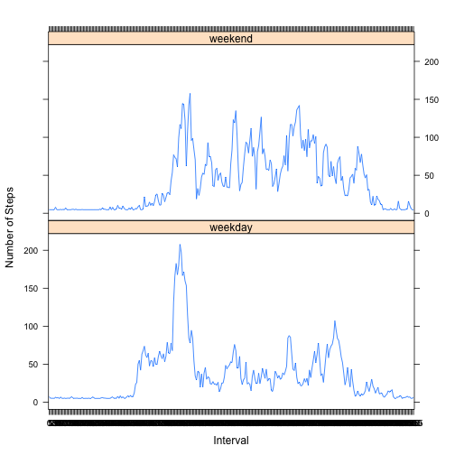

## Loading and preprocessing the data
First, we load the data and transform **date** and **interval** into factor variables.


```r
activity <- read.csv("~/Coursera/Data Science/activity.csv", header = T)
```

## What is mean total number of steps taken per day?
Ignoring the missing values, we got the histogram of total number of steps taken per day as below.


```r
library(dplyr)
library(lattice)
steps_mean1 <- 
  activity %>%
    filter(!is.na(steps)) %>%
      group_by(date) %>%
        summarize(day_steps = sum(steps)) 
hist(steps_mean1$day_steps, main = "Histogram of total number of 
      steps taken per day", xlab = "Total number of steps")
```

 

```r
mean1 <- as.integer(mean(steps_mean1$day_steps))
median1 <- median(steps_mean1$day_steps)
```
The mean and median of the total number of steps taken per day is 10766 and 10765, respectively.

## What is the average daily activity pattern?
The time series plot of the 5-minute interval and the average number of steps taken averaged across all days is as below.


```r
steps_mean2 <- 
  activity %>%
    filter(!is.na(steps)) %>%
      group_by(interval) %>%
        summarize(int_steps = mean(steps, na.rm = T)) 
xyplot(int_steps ~ interval, data = steps_mean2, type = 'l',
       xlab = "Interval", ylab = "Number of Steps")
```

 

```r
max <- steps_mean2$interval[which.max(steps_mean2$int_steps)] 
```
The 5-minuter interval with the maximum number of steps is 835.

## Imputing missing values

```r
total <- sum(is.na(activity))
```

The number of missing values is 2304.Here I filled in the missing values with the mean for each 5-minute interval. The new dataset is *activity2*. The histogram is as below.


```r
activity2 <-  
  activity %>%
    group_by(interval) %>%
      mutate(steps = ifelse(is.na(steps),
                            as.integer(mean(steps, na.rm = T)),
                            steps))
steps_mean3 <- 
  activity2 %>%
    group_by(date) %>%
      summarize(day_steps = sum(steps)) 
hist(steps_mean3$day_steps, main = "Histogram of total number of steps taken per day", xlab = "Total number of steps")
```

 

```r
mean2 <- as.integer(mean(steps_mean3$day_steps))
median2 <- median(steps_mean3$day_steps)
```
The mean and median of the total number of steps taken per day is 10749 and 10641, respectively.

## Are there differences in activity patterns between weekdays and weekends?
*days_ends* is the new factor variable with the two levels: "weekday" and "weekend". Below is the panel plot.


```r
steps_mean4 <- 
  activity2 %>%
    mutate(days_ends = weekdays(as.Date(date))) %>%
      mutate(days_ends = ifelse((days_ends == "Saturday" |
                                   days_ends== "Sunday"),
                                  "weekend","weekday")) %>%
        group_by(interval, days_ends) %>%
          summarize(int_steps = mean(steps, na.rm = T)) 
xyplot(int_steps ~ interval | days_ends, data = steps_mean4, type = 'l',
       layout = c(1,2), xlab = "Interval", ylab = "Number of Steps")
```

 
